# 项目生命周期流程图

## 🔄 完整生命周期概览

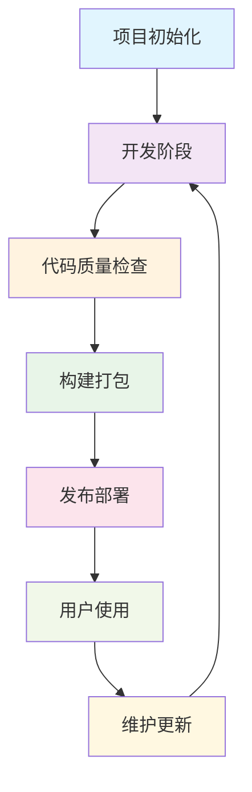

## 📋 详细阶段流程

### 阶段一：项目初始化

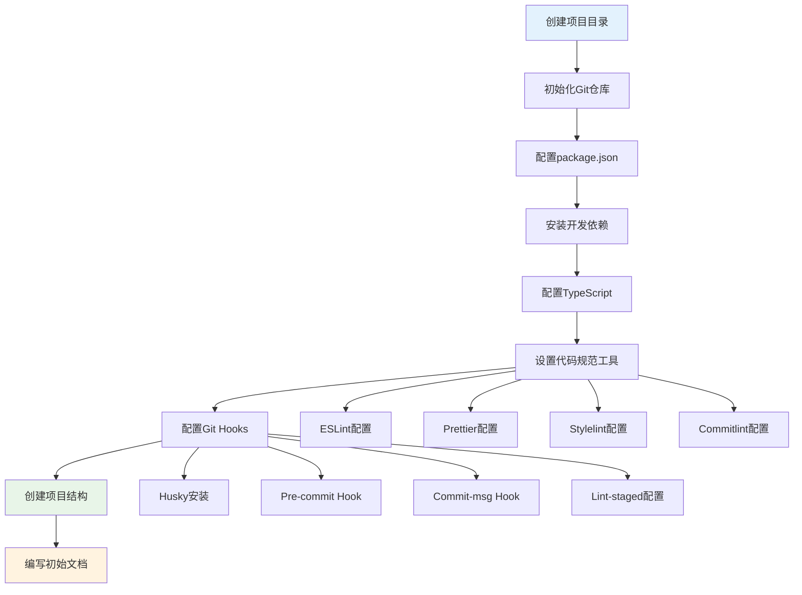

### 阶段二：开发阶段

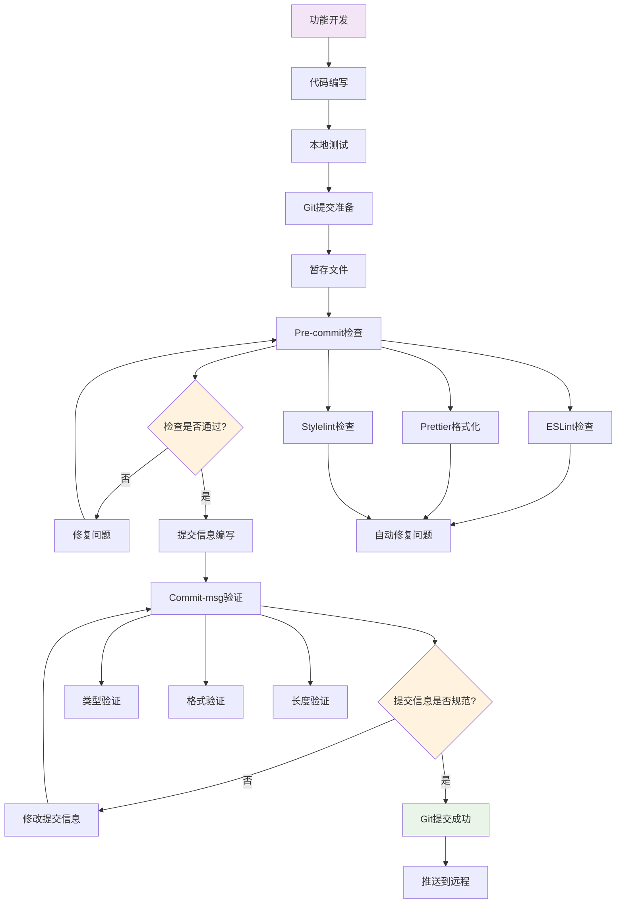

### 阶段三：代码质量检查

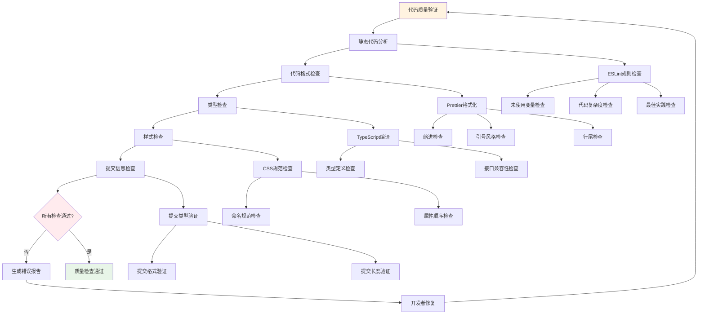

### 阶段四：构建打包

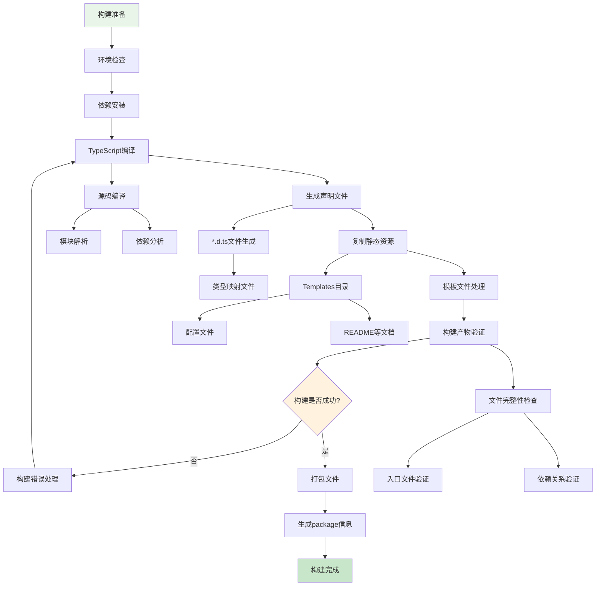

### 阶段五：发布部署

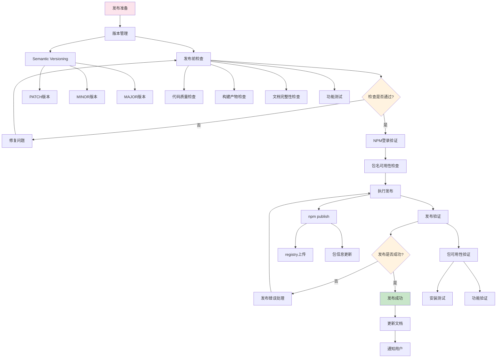

### 阶段六：用户使用

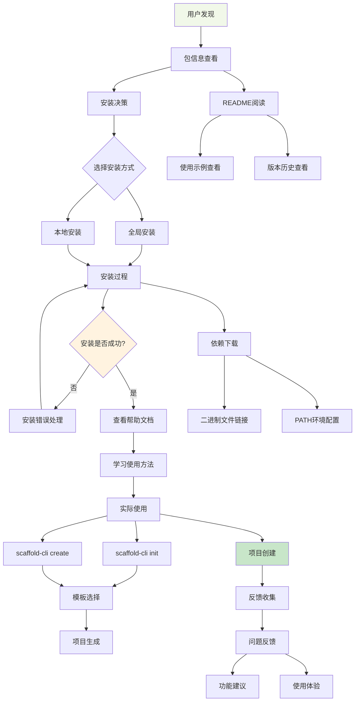

### 阶段七：维护更新

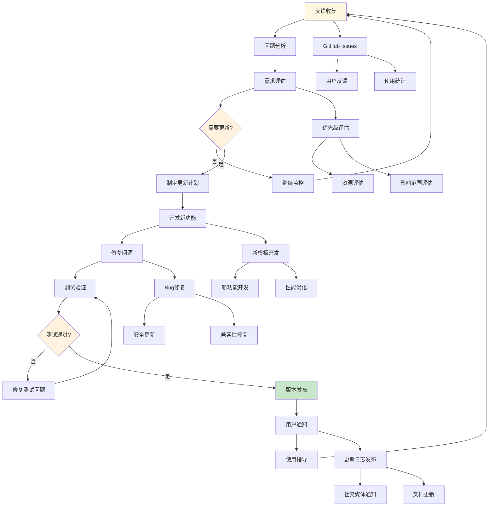

## 🔧 关键检查点详细说明

### Pre-commit 检查流程

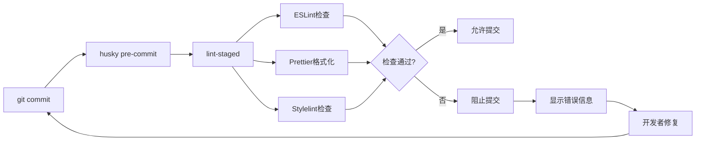

### Commit Message 验证流程

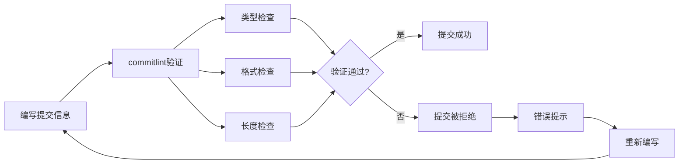

### 发布检查流程

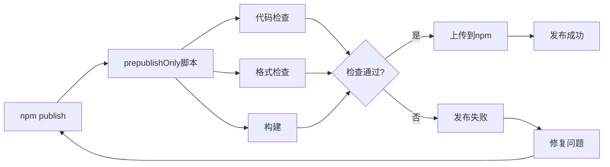

## 📊 质量指标监控

### 代码质量指标

- ✅ ESLint 通过率: 100%
- ✅ Prettier 格式化率: 100%
- ✅ TypeScript 编译通过率: 100%
- ✅ 提交信息规范率: 100%

### 发布质量指标

- ✅ 构建成功率: 100%
- ✅ 测试覆盖率: 待添加
- ✅ 文档完整性: 100%
- ✅ 依赖安全性: 定期检查

### 用户体验指标

- 📥 下载量统计
- ⭐ 用户评分
- 🐛 问题反馈处理时间
- 📝 文档清晰度评价

这个流程图展示了从项目初始化到用户使用的完整生命周期，每个阶段都有详细的子流程和检查点，确保项目质量和用户体验。
