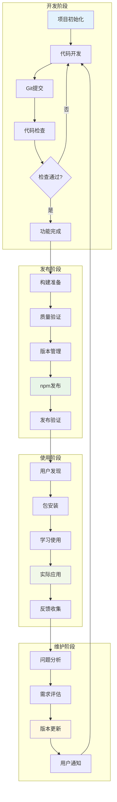
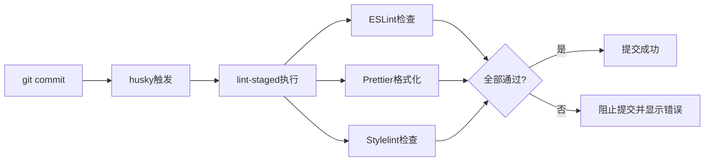
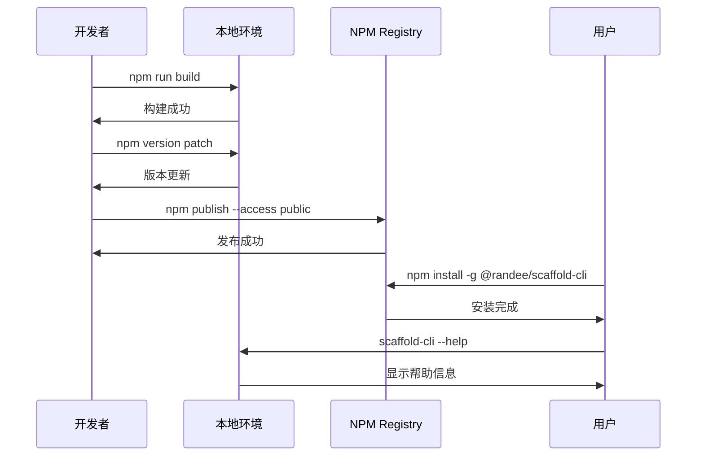
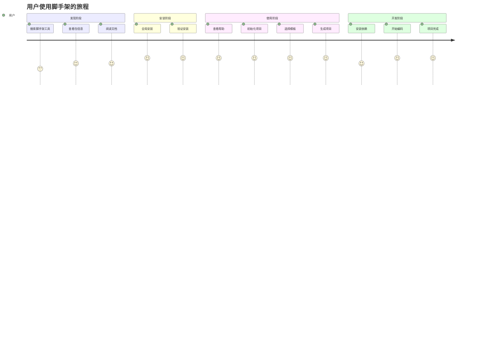
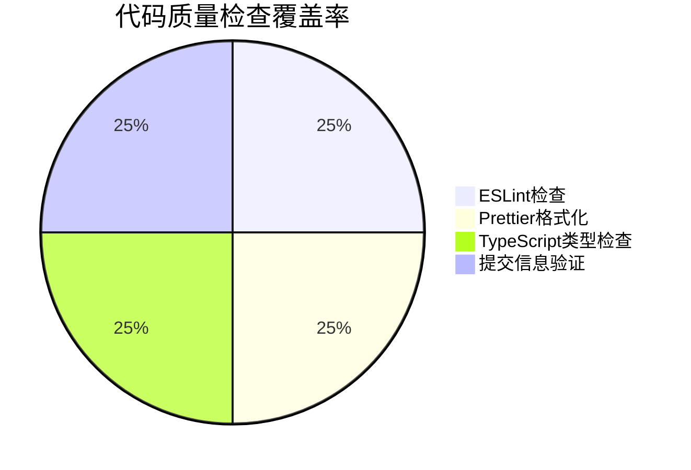

# 项目生命周期总览

## 🎯 核心流程图



## 📋 详细活动清单

### 🚀 开发阶段

| 步骤 | 活动       | 工具/配置                      | 检查点           |
| ---- | ---------- | ------------------------------ | ---------------- |
| 1    | 项目初始化 | git init, npm init             | ✅ Git仓库创建   |
| 2    | 环境配置   | TypeScript, ESLint, Prettier   | ✅ 开发环境就绪  |
| 3    | 代码规范   | Husky, Commitlint, Lint-staged | ✅ Git Hooks配置 |
| 4    | 功能开发   | VS Code, TypeScript            | ✅ 功能实现完成  |
| 5    | 代码提交   | git add, git commit            | ✅ 提交信息规范  |
| 6    | 自动检查   | Pre-commit Hook                | ✅ 代码质量通过  |

#### 代码质量检查详情



### 🔧 构建发布阶段

| 步骤 | 活动     | 命令/脚本             | 检查点                |
| ---- | -------- | --------------------- | --------------------- |
| 1    | 代码检查 | npm run lint          | ✅ 无ESLint错误       |
| 2    | 格式验证 | npm run format:check  | ✅ 代码格式规范       |
| 3    | 类型检查 | npm run build         | ✅ TypeScript编译通过 |
| 4    | 文档检查 | 手动验证              | ✅ 文档完整准确       |
| 5    | 版本管理 | npm version           | ✅ 版本号更新         |
| 6    | 包发布   | npm publish           | ✅ 发布到npm成功      |
| 7    | 发布验证 | npm view, npm install | ✅ 包可正常安装使用   |

#### 发布流程详情



### 👥 用户使用阶段

| 步骤 | 用户活动   | 命令示例                            | 预期结果        |
| ---- | ---------- | ----------------------------------- | --------------- |
| 1    | 发现包     | npm search scaffold                 | 🔍 找到工具     |
| 2    | 查看信息   | npm view @randee/scaffold-cli       | 📄 了解包信息   |
| 3    | 全局安装   | npm install -g @randee/scaffold-cli | 📦 安装成功     |
| 4    | 查看帮助   | scaffold-cli --help                 | 📖 显示使用说明 |
| 5    | 初始化项目 | scaffold-cli init                   | 🚀 创建新项目   |
| 6    | 选择模板   | 交互式选择                          | 📁 生成项目结构 |
| 7    | 开始开发   | cd project && npm install           | 🛠️ 开发环境就绪 |

#### 用户体验流程



### 🔄 维护更新阶段

| 步骤 | 维护活动 | 触发条件             | 处理方式      |
| ---- | -------- | -------------------- | ------------- |
| 1    | 收集反馈 | 用户Issues, 使用统计 | 📊 分析问题   |
| 2    | 问题分类 | Bug, 功能请求, 改进  | 🏷️ 标记优先级 |
| 3    | 开发计划 | 版本规划             | 📅 制定时间表 |
| 4    | 功能开发 | 新特性, Bug修复      | 🔧 代码实现   |
| 5    | 测试验证 | 单元测试, 集成测试   | ✅ 质量保证   |
| 6    | 版本发布 | 遵循语义化版本       | 🚀 更新包     |
| 7    | 用户通知 | 更新日志, 通知       | 📢 告知用户   |

## 📊 关键指标监控

### 开发质量指标



### 发布质量指标

```mermaid
gitgraph
    commit id: "v1.0.0 首次发布"
    commit id: "代码质量工具集成"
    commit id: "文档完善"
    commit id: "发布准备完成"
    branch hotfix
    checkout hotfix
    commit id: "v1.0.1 Bug修复"
    checkout main
    merge hotfix
    commit id: "v1.1.0 新功能"
```

### 用户体验指标

- 📥 **下载统计**: npm下载量趋势
- ⭐ **用户满意度**: GitHub Stars, 用户反馈
- 🐛 **问题响应**: Issue处理时间, 解决率
- 📝 **文档质量**: 文档完整性, 用户理解度

## 🎯 成功标准

### ✅ 开发阶段成功标准

- [ ] 所有代码通过ESLint检查
- [ ] 代码格式符合Prettier规范
- [ ] 提交信息符合Conventional Commits
- [ ] TypeScript编译无错误
- [ ] Git Hooks正常工作

### ✅ 发布阶段成功标准

- [ ] 构建产物完整正确
- [ ] npm包可正常安装
- [ ] CLI命令功能正常
- [ ] 文档准确完整
- [ ] 版本号符合语义化规范

### ✅ 使用阶段成功标准

- [ ] 用户可快速上手
- [ ] 生成的项目结构正确
- [ ] 模板功能满足需求
- [ ] 错误提示清晰有用
- [ ] 性能表现良好

### ✅ 维护阶段成功标准

- [ ] 及时响应用户反馈
- [ ] 定期更新和改进
- [ ] 保持向后兼容性
- [ ] 文档持续更新
- [ ] 社区活跃度良好

这个完整的生命周期图表涵盖了从开发到维护的所有阶段，每个阶段都有详细的活动说明和检查点，确保项目的高质量交付和持续改进。
