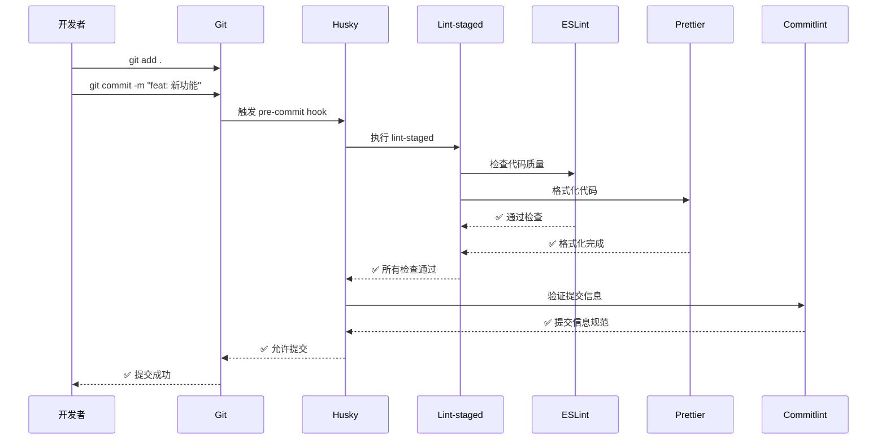
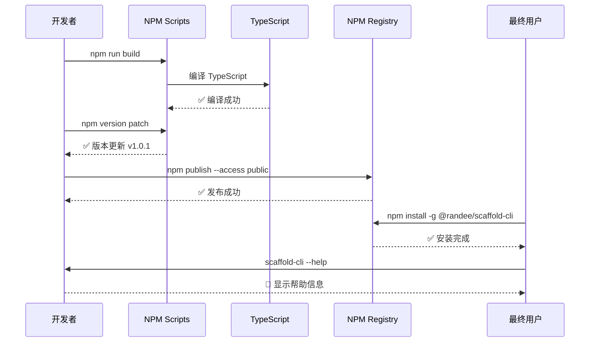
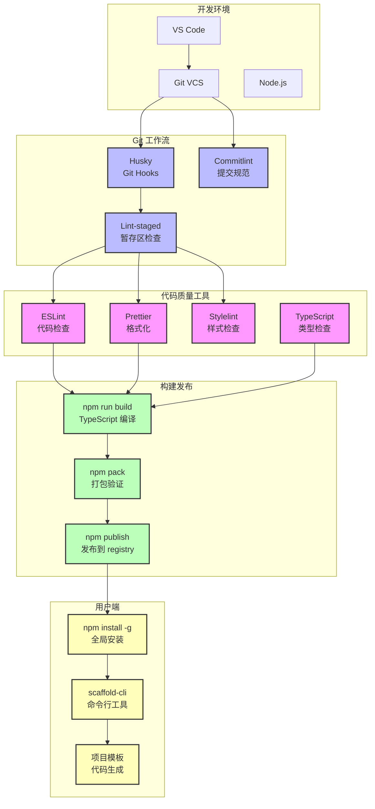

# 脚手架工程生命周期可视化

## 🔄 完整生命周期流程

```mermaid
flowchart TD
    %% 开发阶段
    subgraph DEV["🚀 开发阶段"]
        A1[项目初始化<br/>git init, npm init]
        A2[环境配置<br/>TypeScript + 工具链]
        A3[代码开发<br/>功能实现]
        A4[提交代码<br/>git commit]
        A5[质量检查<br/>ESLint + Prettier]
        A6{检查通过?}
        A7[开发完成]

        A1 --> A2 --> A3 --> A4 --> A5 --> A6
        A6 -->|否| A3
        A6 -->|是| A7
    end

    %% 构建发布阶段
    subgraph BUILD["🔧 构建发布阶段"]
        B1[构建准备<br/>npm run build]
        B2[质量验证<br/>全面检查]
        B3[版本管理<br/>npm version]
        B4[包发布<br/>npm publish]
        B5[验证发布<br/>安装测试]

        B1 --> B2 --> B3 --> B4 --> B5
    end

    %% 用户使用阶段
    subgraph USE["👥 用户使用阶段"]
        C1[用户发现<br/>npm search]
        C2[查看信息<br/>npm view]
        C3[全局安装<br/>npm install -g]
        C4[学习使用<br/>--help, 文档]
        C5[实际应用<br/>scaffold-cli init]
        C6[项目生成<br/>模板应用]
        C7[开发使用<br/>基于生成项目]

        C1 --> C2 --> C3 --> C4 --> C5 --> C6 --> C7
    end

    %% 维护更新阶段
    subgraph MAINTAIN["🔄 维护更新阶段"]
        D1[收集反馈<br/>Issues + 统计]
        D2[问题分析<br/>优先级评估]
        D3[功能开发<br/>新特性 + 修复]
        D4[版本发布<br/>更新包]
        D5[用户通知<br/>变更日志]

        D1 --> D2 --> D3 --> D4 --> D5
    end

    %% 连接各阶段
    A7 --> B1
    B5 --> C1
    C7 --> D1
    D5 --> A3

    %% 样式
    classDef devStyle fill:#e3f2fd,stroke:#1976d2,stroke-width:2px
    classDef buildStyle fill:#e8f5e8,stroke:#388e3c,stroke-width:2px
    classDef useStyle fill:#f1f8e9,stroke:#689f38,stroke-width:2px
    classDef maintainStyle fill:#fff8e1,stroke:#f57c00,stroke-width:2px

    class A1,A2,A3,A4,A5,A7 devStyle
    class B1,B2,B3,B4,B5 buildStyle
    class C1,C2,C3,C4,C5,C6,C7 useStyle
    class D1,D2,D3,D4,D5 maintainStyle
```

## 📊 关键检查点流程

### Git 提交质量控制

### 发布流程控制

## 🛠️ 工具链集成架构

## 📋 阶段性活动清单

### 🚀 开发阶段活动

| 序号 | 活动名称     | 使用工具           | 输入     | 输出      | 验收标准        |
| ---- | ------------ | ------------------ | -------- | --------- | --------------- |
| 1    | 项目初始化   | git, npm           | 空目录   | 项目骨架  | ✅ 目录结构完整 |
| 2    | 配置开发环境 | TypeScript, ESLint | 基础配置 | 开发环境  | ✅ 工具链可用   |
| 3    | 实现核心功能 | VS Code            | 需求文档 | 功能代码  | ✅ 功能测试通过 |
| 4    | 设置质量检查 | Husky, Lint-staged | Git仓库  | Git Hooks | ✅ 自动检查生效 |
| 5    | 编写单元测试 | Jest (计划中)      | 功能代码 | 测试用例  | ✅ 覆盖率达标   |
| 6    | 完善文档     | Markdown           | 项目代码 | 说明文档  | ✅ 文档完整准确 |

### 🔧 构建发布活动

| 序号 | 活动名称     | 执行命令               | 检查项目       | 成功标准             |
| ---- | ------------ | ---------------------- | -------------- | -------------------- |
| 1    | 代码质量检查 | `npm run lint`         | ESLint规则     | 0 errors, 0 warnings |
| 2    | 代码格式检查 | `npm run format:check` | Prettier规则   | 格式一致性100%       |
| 3    | 类型检查编译 | `npm run build`        | TypeScript编译 | 编译成功，无类型错误 |
| 4    | 包完整性验证 | `npm pack`             | 包内容         | 包含所有必需文件     |
| 5    | 版本号管理   | `npm version`          | 语义化版本     | 版本号符合规范       |
| 6    | 发布到NPM    | `npm publish`          | 包可用性       | 可正常安装使用       |

### 👥 用户使用流程

| 阶段 | 用户操作              | 系统响应     | 预期体验    |
| ---- | --------------------- | ------------ | ----------- |
| 发现 | 搜索脚手架工具        | 展示包信息   | 🔍 易于发现 |
| 了解 | 查看文档和示例        | 提供详细说明 | 📖 快速理解 |
| 安装 | `npm install -g`      | 全局安装成功 | ⚡ 安装简单 |
| 学习 | `scaffold-cli --help` | 显示使用帮助 | 💡 指导明确 |
| 使用 | `scaffold-cli init`   | 交互式创建   | 🎯 操作简便 |
| 应用 | 基于模板开发          | 生成完整项目 | 🚀 开箱即用 |

### 🔄 维护更新活动

| 类型     | 触发条件     | 处理流程                          | 输出结果    |
| -------- | ------------ | --------------------------------- | ----------- |
| Bug修复  | 用户反馈问题 | 问题复现 → 修复 → 测试 → 发布     | 🐛 问题解决 |
| 功能增强 | 新需求提出   | 需求分析 → 开发 → 测试 → 发布     | ✨ 功能增加 |
| 安全更新 | 依赖漏洞发现 | 漏洞评估 → 依赖更新 → 测试 → 发布 | 🔒 安全加固 |
| 性能优化 | 性能问题反馈 | 性能分析 → 优化 → 测试 → 发布     | ⚡ 性能提升 |
| 文档更新 | 信息过时     | 内容更新 → 审核 → 发布            | 📚 文档准确 |

## 🎯 质量度量指标

### 代码质量指标

- **ESLint 通过率**: 100% (0 errors, 0 warnings)
- **Prettier 一致性**: 100% (所有文件格式统一)
- **TypeScript 编译**: 100% (无类型错误)
- **提交规范率**: 100% (符合 Conventional Commits)

### 发布质量指标

- **构建成功率**: 100% (无构建失败)
- **包完整性**: 100% (包含所有必需文件)
- **安装成功率**: 100% (可正常安装)
- **功能可用性**: 100% (CLI命令正常工作)

### 用户体验指标

- **文档完整度**: 95%+ (覆盖主要使用场景)
- **上手容易度**: 用户首次使用成功率 > 90%
- **问题解决率**: 用户问题回复率 > 95%
- **更新及时性**: 重要问题 24小时内响应

这个完整的生命周期图表展示了从开发、构建、发布到用户使用和维护的全过程，每个阶段都有明确的活动、工具和质量标准，确保整个项目的高质量交付和持续改进。
